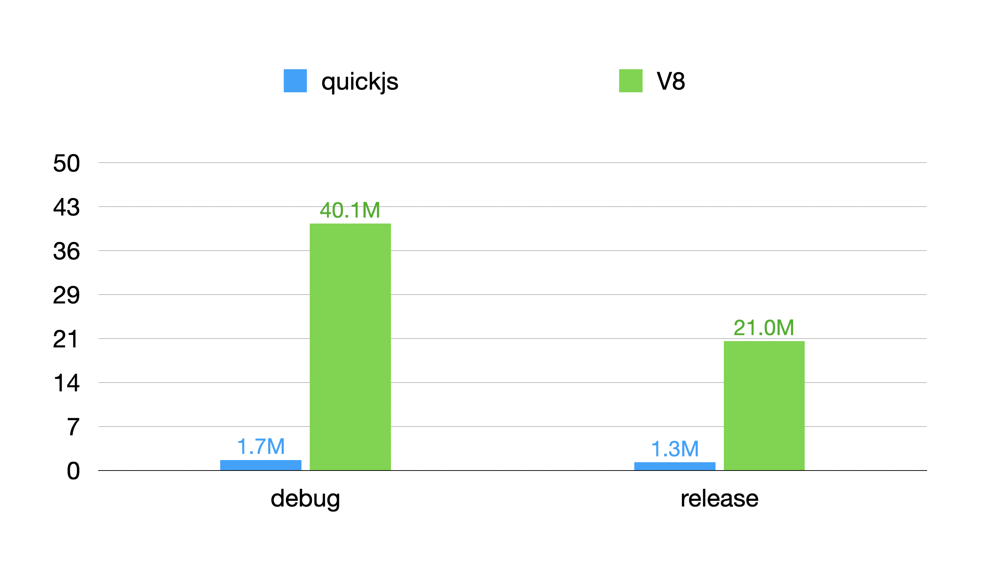

# rust_v8_and_quickjs

## Size

|             | debug       | release    |
|-------------|------------:|-----------:|
| **quickjs** |  1,758,728  |  1,281,104 |
| **v8**      | 40,047,648  | 20,956,816 |

## Chart

### License

[rust_v8_and_quickjs](https://github.com/justjavac/rust_v8_and_quickjs) is released under the MIT License. See the bundled [LICENSE](../LICENSE) file for details.
